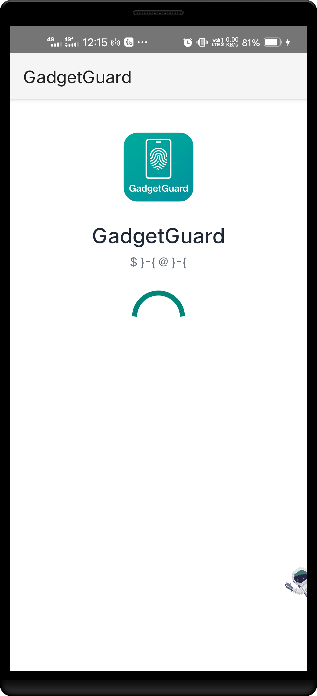
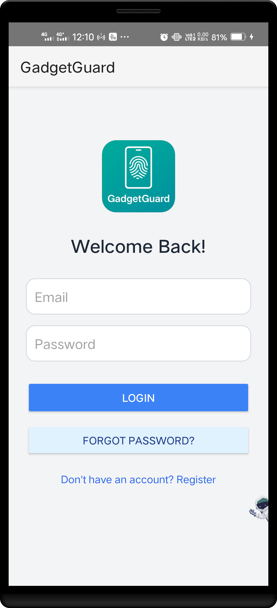
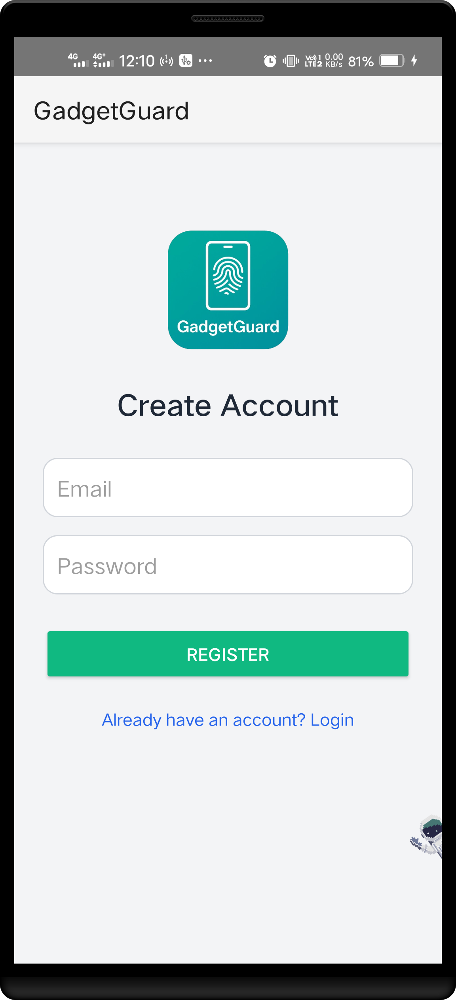
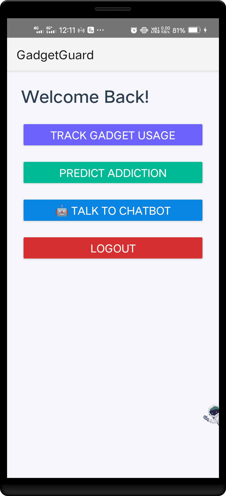
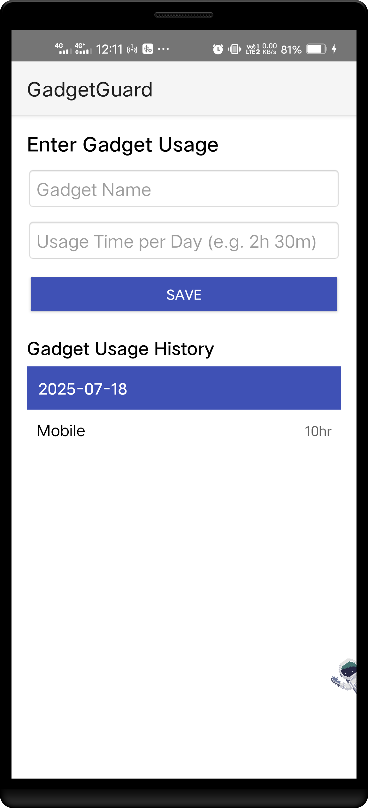
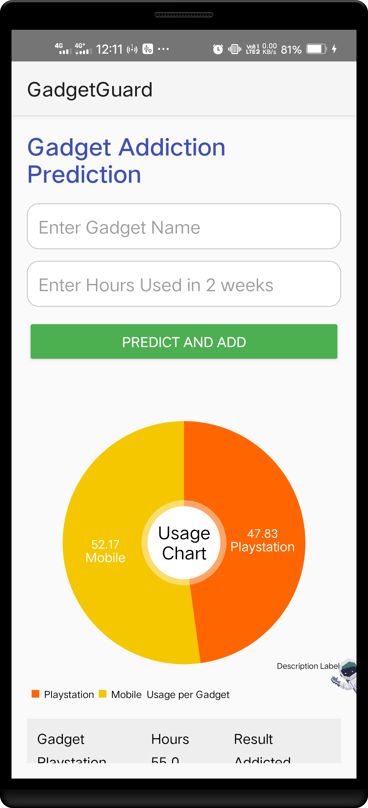
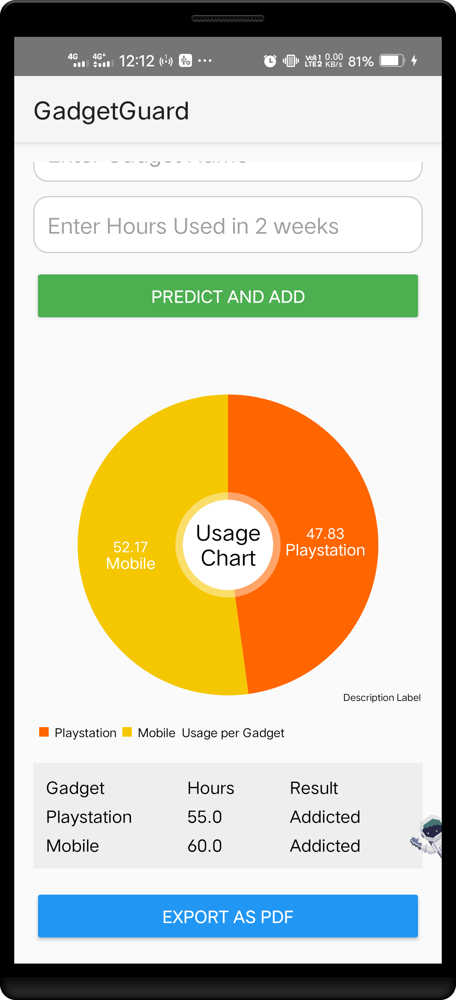
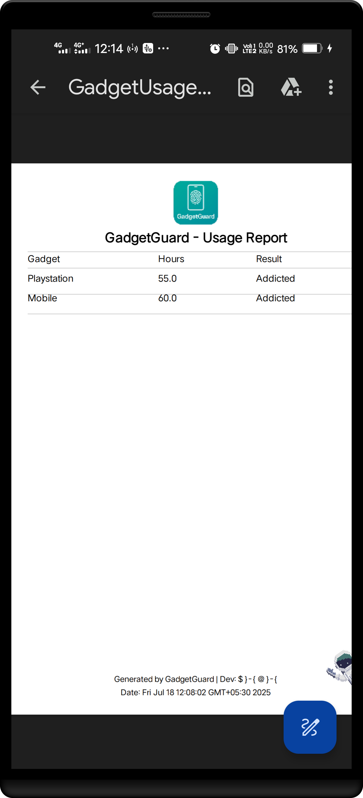
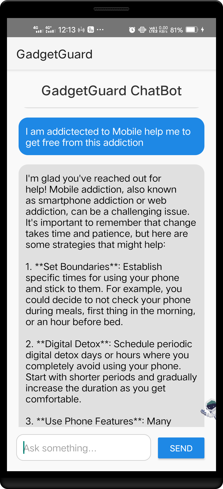

# 📱 GadgetGuard - Gadget Addiction Tracker App

<p align="center">
  
</p>

**GadgetGuard** is a secure and intelligent Android app designed to help users track gadget usage and predict gadget addiction using a local TensorFlow Lite model. It includes a chatbot to suggest healthy digital habits, biometric security, data visualization, and PDF export features.

---

## ✨ Features

- 🔐 **Biometric Lock** for secure access
- 📝 **Register/Login** using Firebase Authentication
- 📊 **Track Gadget Usage** (Gadget name, Hours used)
- 🔍 **Addiction Prediction** using TensorFlow Lite
- 📈 **Pie Chart Visualization** of usage
- 🧠 **Chatbot** to help reduce screen time
- 📄 **PDF Export** of usage data with elegant design
- ☁️ **Firestore** storage for usage history
- 🧾 Sticky date headers for enhanced report viewing

---

## 📸 Screenshots

| Splash Screen | Login | Register |
|---------------|--------|----------|
|  |  |  |

| Dashboard | Usage Entry | Prediction |
|-----------|-------------|------------|
|  |  |  |

| PDF Export | Report | Chatbot |
|------------|--------|---------|
|  |  |  |

---

## ⚙️ Setup Instructions

### 🧩 Prerequisites

- Android Studio (Electric Eel or later recommended)
- Java 17+
- Firebase Project with:
  - Authentication (Email/Password)
  - Firestore Database
- TensorFlow Lite `.tflite` model file (place it under `app/src/main/assets/`)
- Internet connection

### 🔌 Dependencies Used

- `Firebase Authentication & Firestore`
- `TensorFlow Lite`
- `MPAndroidChart` for pie charts
- `iText7` for PDF generation
- `BiometricPrompt` for fingerprint auth

---

### 🚀 How to Run the App

1. Clone the repository:
   ```bash
   git clone https://github.com/your-username/GadgetGuard.git
   cd GadgetGuard
